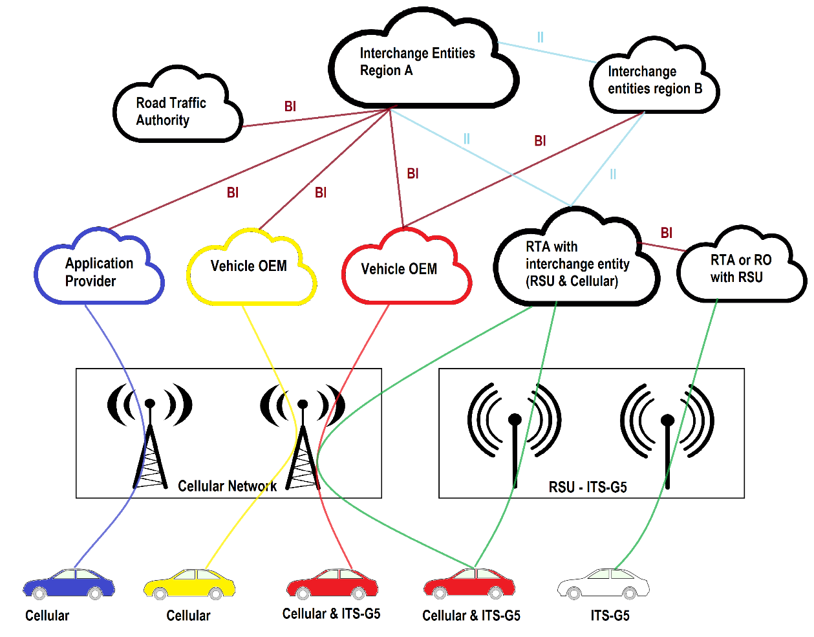

# NWIXN Backend - FM4019 Project

This is a part of the FM4019 Project course at University of Southeast-Norway during the fall 2020. The aim of the project is to make a testsystem for testing various C-ITS and CCAM services in cojunction with the [NordicWay3-project](http://www.nordicway.net).

This repo contains the backend system that serves as content provider or OEM-cloud between the NordicWay Interchange Node and the car.
<dl>

</dl>

## Main goal of FM4019

One of the main goals of this project is to make a system for assessing the use of the services that the NWIXN-backend shall support. The testruns and analysis of this services is planned to be done as part of the upcoming masterthesis, while for this project, the goal is to make a system that can replicate 

## Important parts

### Logging system

### 
